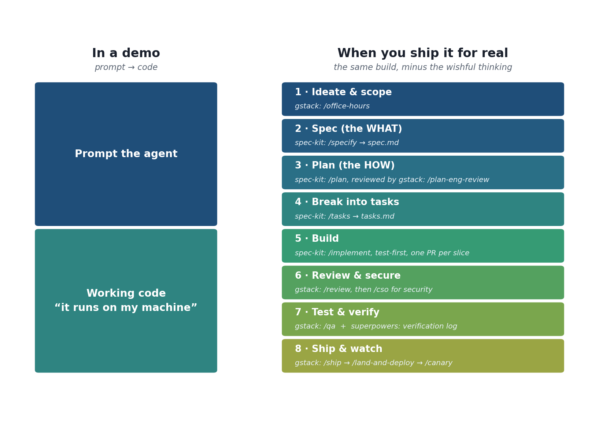
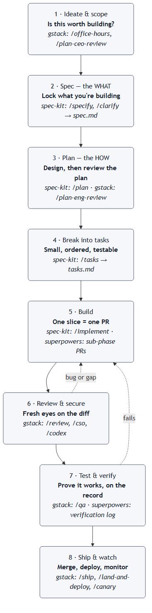

<!--
Title: A Simple Blueprint for Building Software with AI Agents
Subtitle: Stealing the best of Spec Kit, Superpowers and GStack into one workflow a data scientist can actually follow
Tags: AI Agents, Software Development, Spec-Driven Development, Claude Code, Developer Workflow, Data Science
Images:
  - assets/hero-blueprint.jpg : "Photo by Amsterdam City Archives on Unsplash" : https://unsplash.com/photos/URnyBZCnlIs
  - assets/demo-vs-real.png : "Image by Author" (generated, matplotlib) : demo vs. ship-for-real stack
  - assets/blueprint.png : "Image by Author" (generated, Mermaid) : the 8-stage pipeline
Photo credits: Hero, Amsterdam City Archives on Unsplash. Diagrams, by Author.
-->

# A Simple Blueprint for Building Software with AI Agents

*Stealing the best of Spec Kit, Superpowers and GStack into one workflow a data scientist can actually follow, from idea to shipped.*

*Photo by Amsterdam City Archives on Unsplash*

I'll be honest about where I'm coming from. I've spent years in data science, and for most of that time my "development process" was a notebook, a lot of cells run out of order, and faith that I'd remember what I did last Tuesday. It works right up until the thing you built has to survive being used by someone who isn't you. Data scientists learn to model. We rarely learn the software development lifecycle around the model: the spec, the plan, the review, the tests, the boring paperwork that stops a Friday deploy becoming a Saturday incident.

Then AI coding agents arrived, and with them a wave of frameworks that bolt a real engineering process onto the agent. Three kept coming up in my setup: **Spec Kit**, **Superpowers**, and **GStack**. Each is good. Between them they also carry something like sixty slash-commands, which is a lot to stare at on a Monday. So I did what I do with any new tool: tried them, got confused, and distilled the confusion into one blueprint I could remember. The remarks below are my personal take basis usage, not a benchmark, and there's no promotion here.

*Image by Author*

## Vibe coding got us here, and where it stops

Andrej Karpathy coined "vibe coding" in early 2025: you give in to the vibes and, in his words, *"'Accept All' always, I don't read the diffs anymore."* For a weekend throwaway it's genuinely great. The trouble starts on the last stretch. Addy Osmani calls it the 70% problem: the agent sprints you to 70 percent, then the final 30 becomes "whack-a-mole with code you don't fully understand." Simon Willison's definition lands it, vibe coding is "generating code with AI without caring about the code that is produced." Fine when it's just you; risky the moment it touches production or a teammate.

The fix isn't to stop using agents. It's to give the agent a *document* to build against instead of a vibe, so every change is small and reviewable. That is the whole point of the blueprint below.

## A one-minute primer on the three toolkits

- **Spec Kit** (GitHub): the planning engine. It turns an idea into readable Markdown, `spec.md` then `plan.md` then `tasks.md`, so the agent codes against a document.
- **GStack**: the review-and-ship engine. A command for every late stage: `/office-hours`, `/plan-eng-review`, `/review`, `/cso`, `/qa`, `/ship`, `/canary`.
- **Superpowers** (obra): the discipline. Real test-driven development and an append-only verification log. It's actually the most-starred of the three (roughly 243k stars to Spec Kit's 117k), but it bakes its method into agent behaviour and runs only on Claude. So I anchor on Spec Kit for the method itself, because a newcomer learns faster when the method lives in files you can read, and lean on Superpowers for how the building actually gets done: test first, and prove it afterwards.

*Image by Author*

## The blueprint, stage by stage

Pick the stages your work has actually earned. A throwaway script needs almost none of this; anything another human will touch needs most of it.

**1. Ideate and scope.** Before any code, ask whether the thing is worth building. GStack's `/office-hours` challenges the premise and offers alternatives instead of rubber-stamping your first idea. The most expensive code is the code you shouldn't have written.

**2. Spec, the WHAT.** Spec Kit's `/specify` writes `spec.md`: what you're building, success criteria, edge cases, and no implementation detail. `/clarify` then makes you quantify the vague words, so "fast" becomes "under 200ms". This single habit changed my output the most.

**3. Plan, the HOW.** `/plan` turns the spec into an architecture in `plan.md`. Hand that to GStack's `/plan-eng-review`. Spec Kit writes the plan; GStack asks whether it's any good. Catching a design flaw here, on a Markdown file, is far cheaper than catching it in code.

**4. Break it into tasks.** `/tasks` splits the plan into `tasks.md`, a list of small, ordered, testable steps. Now both you and the agent always know what "done" means.

**5. Build.** `/implement` works the task list, and this is where Superpowers earns its place. Two habits worth stealing: write the failing test first (no production code without a test that proves it), and build in small slices, one pull request each, never a 4,000-line blob nobody can review. The trade-off is real, test-first and small PRs are slower to ship and far easier to trust and to review.

**6. Review and secure.** An agent reviewing its own code has the same blind spot as a student grading their own exam. GStack's `/review` is the gate every diff should pass. For anything security-sensitive, add `/cso` for an OWASP-style audit, and `/codex` when a genuinely different model's second opinion is worth the extra step. Security is a named stage here, not a vague good intention.

**7. Test and verify.** `/qa` drives a real browser through every route, finds bugs, and fixes them. Then keep the proof, an idea I took from Superpowers: an append-only verification log stamped with the commit, the test, and the result. You append, never edit, so a wrong-then-corrected entry becomes the audit trail. It feels like paperwork until the day someone asks "was this actually tested?" and you answer with a commit hash instead of a shrug.

**8. Ship and watch.** `/ship` opens the PR, `/land-and-deploy` merges and deploys, `/canary` watches production for errors afterwards. The unglamorous tail that data science training skips entirely.

## Using it for everyday work: features and PRs

You rarely start from a blank repo. Most real work is a new feature on an existing codebase, or reviewing someone else's change. The blueprint scales down for both.

For a **new feature**, run the same eight stages in miniature: a short spec for just that feature, a quick plan, a handful of tasks, then build. Spec Kit is designed for this iterative loop, not only greenfield projects, so you get a fresh `spec.md` per feature while the old ones stay behind as a record of why things are the way they are.

For **reviewing a PR**, the "one slice, one PR" habit from stage 5 is what makes review possible at all. A small, single-purpose diff is something a human, or `/review`, or a second model through `/codex`, can actually reason about. Point the same review gate at a teammate's PR, not just your own. A 4,000-line PR does not get reviewed, it gets rubber-stamped.

## The real value: it forces you to think first

Look back at those eight stages and notice what they share: almost every one exists to make you think and design in detail before a line of code is written. The spec makes you decide what you are building. The plan makes you decide how, on paper, where changing your mind is cheap. Review and security make you look hard before you ship. Left to itself, an agent skips all of it and starts typing. This workflow is the forcing function that makes you slow down and design first, and that discipline, far more than any single command, was the piece I had been missing. It isn't infrastructure or tooling. It's a way of thinking that the tools happen to make cheap.

## Learnings

- The process is the point, not the tool. The real unlock was internalising the sequence and the reason for each step; the toolkits just make each step cheap.
- Spec Kit plans, Superpowers keeps the build honest, GStack ships. If you remember one split, remember that.
- Security and verification were my two biggest gaps, and they're exactly the two a modeller's training never covers. Making them named, non-skippable steps did more for me than any amount of better prompting.

If you're a data or ML person who has always felt slightly fraudulent about the "software" half of the job, this is the scaffolding I wish I'd had. Steal it, drop the stages your work hasn't earned, and make it yours.

## References

1. Andrej Karpathy, the original "vibe coding" post (Feb 2025). https://x.com/karpathy/status/1886192184808149383
2. Simon Willison, "Not all AI-assisted programming is vibe coding." https://simonwillison.net/2025/Mar/19/vibe-coding/
3. Addy Osmani, "The 70% problem: hard truths about AI-assisted coding." https://addyo.substack.com/p/the-70-problem-hard-truths-about
4. Spec-Driven Development with AI, The GitHub Blog. https://github.blog/ai-and-ml/generative-ai/spec-driven-development-with-ai-get-started-with-a-new-open-source-toolkit/
5. Spec Kit, GitHub's spec-driven development toolkit. https://github.com/github/spec-kit
6. Superpowers, Jesse Vincent (obra). https://github.com/obra/superpowers
7. GStack, the review-and-ship skill collection referenced here, from my own Claude Code setup.
